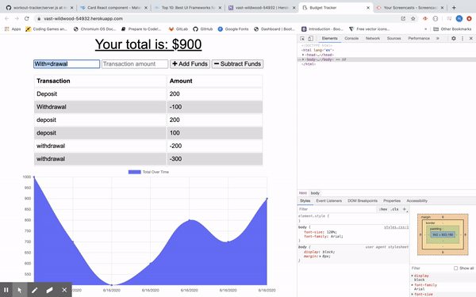
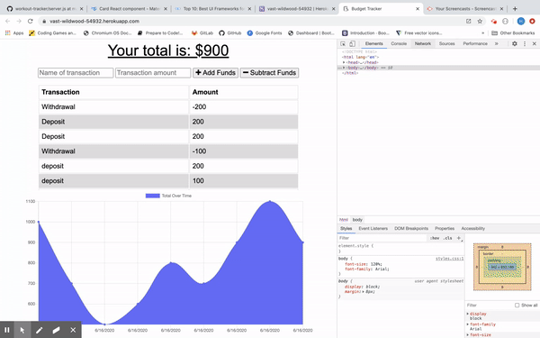
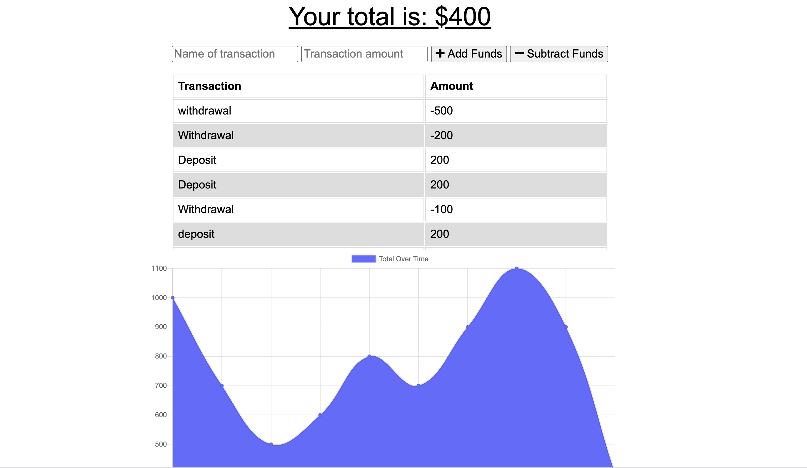

# BUDGET-TRACKER
 

## Description
 

This is a simple financial budget tracker application that allows Users to add and subtract funds from their total balance. The whole application is using MongoDB to save transactions as well as IndexedDB for when the application is offline. What is so special about this application is even if the application is offline, the User won't notice it since it will still be able to make transactions and see the results on the screen... Then, how is it possible??? This is a <a href = "https://developer.mozilla.org/en-US/docs/Web/Progressive_web_apps"><strong>Progressive Web Apps</strong></a> (PWAs). What this means is that this applications gets installed in your system and when possible works offline utilizing cached data. Inside the public folder you can see a file called "serviceWorker.js". Service workers are the most important technology allowing offline use in PWAs they are basically JavaScript files that run independently from the web app itself. Also, as mentioned above, we are using <a href = "https://developer.mozilla.org/en-US/docs/Web/API/IndexedDB_API"><strong>IndexedDB</strong></a>, which is a large-scale, NoSQL storage system. It lets you store just about anything in the user's browser. In addition to the usual search, get, and put actions, IndexedDB also supports transactions. 

 

 

## Installation
 

The application can be forked or cloned from GITHUB. The app is launched in Heroku and can be opened by clicking <a href = "https://vast-wildwood-54932.herokuapp.com/"> HERE</a>. 

 

## TECHNOLOGIES

<ul>
    <li><a href = "https://developer.mozilla.org/en-US/docs/Web/JavaScript">JavaScript</a></lil>
    <li><a href = "https://developer.mozilla.org/en-US/docs/Web/API/Node">Node.js</a></lil>
    <li><a href = "https://expressjs.com/">Express.js</a></lil>
    <li><a href = "https://mongoosejs.com/docs/">Mongoose</a></lil>
    <li><a href = "https://developer.mozilla.org/en-US/docs/Web/API/IndexedDB_API">IndexedDb</a></lil>
</ul>

 

## Questions
 

Check out the app <a href = "https://vast-wildwood-54932.herokuapp.com/" target = "blank">HERE...</a> 
<a href = "mailto:gohucosta23@hotmail.com">gohucosta23@hotmail.com</a> 
